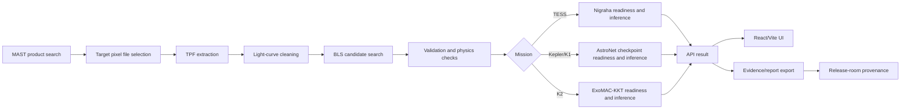

# OrbitLab Architecture

Status: current for OrbitLab `v0.2.0`.

OrbitLab is a full-stack research workbench built around an explicit data path from public archive product to candidate review.

## Backend

The FastAPI app in `backend/orbitlab/api/main.py` exposes the public API under `/api/v1`. Storage lives in SQLAlchemy models under `backend/orbitlab/storage/`. Analysis jobs can run inline for local demos or through Celery for worker-backed deployments.

## Science Pipeline

Science modules under `backend/orbitlab/science/` handle MAST product discovery, TPF resolution, light-curve extraction, cleaning, BLS/TLS search, folding, validation helpers, TCE ledger construction, promotion gates, catalog context, and physics estimates. The pipeline is designed to fail loudly when real products are unavailable.

Important contract:

- `tces` is the ledger of reviewable threshold-crossing events.
- `planet_candidates` is the promoted subset after evidence gates pass.
- `candidates` is a response-time compatibility alias for older clients.
- A promoted candidate is not a confirmed planet; it is follow-up evidence under OrbitLab's current rules.

## ML Services

ML services under `backend/orbitlab/ml/` validate model artifacts before reporting readiness. The registry records artifact path, mission, source, version, format, and SHA-256. `GET /api/v1/models` is the canonical readiness surface.

Model services are allowed to return unavailable states. They are not allowed to invent a score when an artifact is missing, empty, checksum-mismatched, or incompatible with the expected tensor/catalog contract.

## Frontend

The frontend is a React/Vite application in `frontend/src/`. It calls the FastAPI backend, renders search/product workflows, plots science outputs, and gives users a visual way to inspect candidate evidence.

## Runtime State

Runtime files belong under `.orbitlab/` and are intentionally ignored by git. This includes MAST cache files, model artifacts, logs, pid files, and the default SQLite database.

## Release Provenance Layer

Release provenance is generated by `scripts/build_release_room.py` and automated by `.github/workflows/release-room.yml`.

The release-room layer collects:

- Git release metadata.
- Model artifact readiness and checksums from `.orbitlab/models.json`.
- Calibration/source checksums for science config, calibration code, and key methodology/model docs.
- Science benchmark output and benchmark deltas.
- SPDX 2.3 SBOM data from `pyproject.toml` and `frontend/package-lock.json`.
- Checksums for generated release assets.
- A zipped release-room packet, uploaded to GitHub Releases and attested by GitHub Actions.

This layer is intentionally outside the runtime API: it is a release audit trail, not a user-facing inference engine. It should be used to review whether a release was built from traceable inputs, not to reinterpret scientific dispositions.
