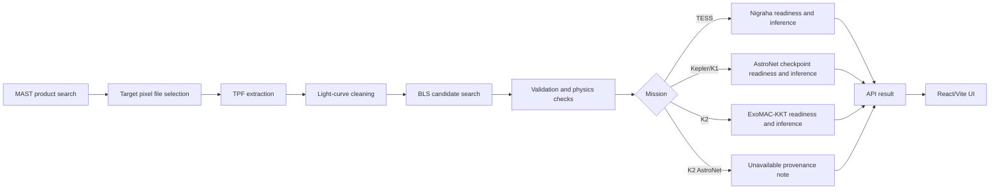

# OrbitLab Architecture

OrbitLab is a full-stack research workbench built around an explicit data path from public archive product to candidate review.

## Backend

The FastAPI app in `backend/orbitlab/api/main.py` exposes the public API under `/api/v1`. Storage lives in SQLAlchemy models under `backend/orbitlab/storage/`. Analysis jobs can run inline for local demos or through Celery for worker-backed deployments.

## Science Pipeline

Science modules under `backend/orbitlab/science/` handle MAST product discovery, TPF resolution, light-curve extraction, cleaning, BLS search, folding, and validation helpers. The pipeline is designed to fail loudly when real products are unavailable.

## ML Services

ML services under `backend/orbitlab/ml/` validate model artifacts before reporting readiness. The registry records artifact path, mission, source, version, format, and SHA-256. `GET /api/v1/models` is the canonical readiness surface.

## Frontend

The frontend is a React/Vite application in `frontend/src/`. It calls the FastAPI backend, renders search/product workflows, plots science outputs, and gives users a visual way to inspect candidate evidence.

## Runtime State

Runtime files belong under `.orbitlab/` and are intentionally ignored by git. This includes MAST cache files, model artifacts, logs, pid files, and the default SQLite database.
